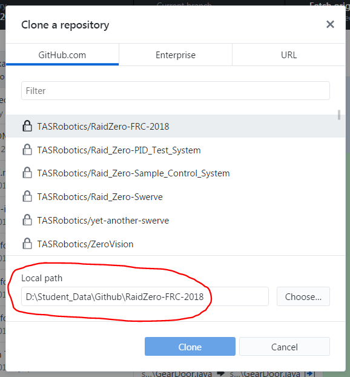
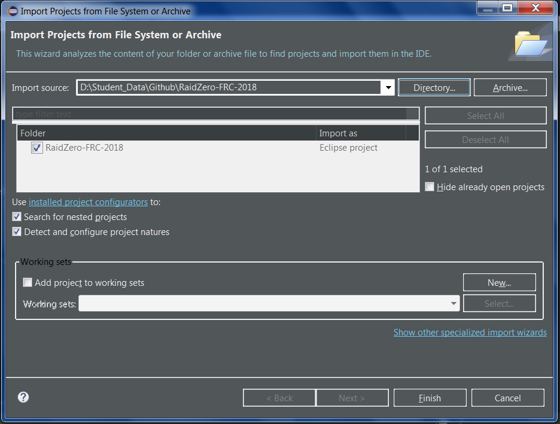

# Getting started

## GitHub web interface

Each repository has a web interface on github.com which can be accessed in your browser. The URL for each repo is github.com/`user or organization name`/`repo name`. For example the current page you are reading is in the guide repo, so the URL is github.com/TASRobotics/guide. Note that all TASRobotics repos are private, so you must be signed in to access them.

In the web interface, you can browse the files in the repository, as well as use issues and pull requests.

## Git client

In order to work on projects, you have to have git on your computer. There are several things you can use:

- [GitHub Desktop.](https://desktop.github.com) This is the git client created by GitHub. It has a simple user interface and integration with GitHub, and it is easier to use than the other options. However, it is less flexible. **The instructions in this guide will use GitHub Desktop**.
- [EGit.](http://www.eclipse.org/egit/) This is a git client plugin for Eclipse. You can access it directly from inside Eclipse, and it has more options than GitHub Desktop. However, it is harder to use.
- [Command line git.](https://git-scm.com/downloads) You can use git directly on the command line. This is the most flexible option, and the git GUIs are built on top of this. However, you need to memorize some commands, in addition to being familiar with the command line. Therefore, if you are new to git, you should use one of the above options.

Install the client you want and set it up.

## Cloning

To make changes to a repo, you have to clone it (i.e. download it to your computer). In GitHub Desktop, go to `File > Clone repository`, then choose the repo you want to clone, which will probably be TASRobotics/RaidZero-FRC-2018. **Pay attention to the "Local path" option:** make sure you know where it is cloning to.

## Importing into Eclipse

The repo should already contain all the metadata for an Eclipse project. So in Eclipse, go to `File > Open Projects from File System`. Select `Directory`, and choose the folder where you cloned the repo.

