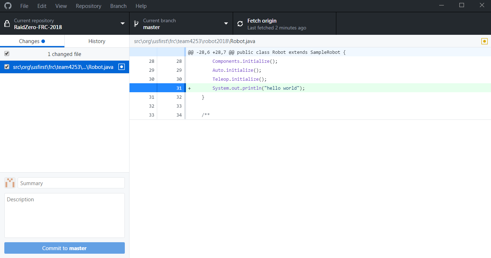
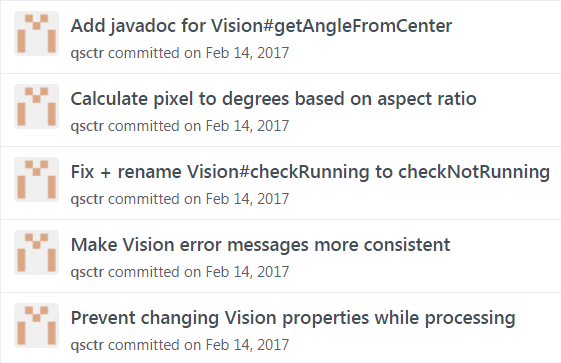
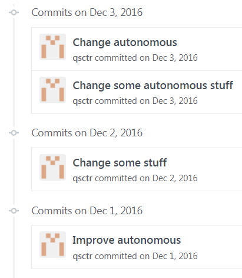
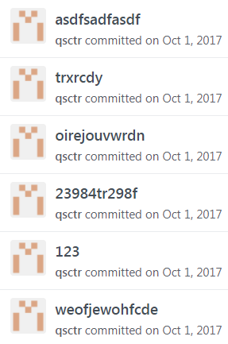

# Commits

Git tracks changes to your code by tracking commits. After you change something in your code, you should make a commit. Each commit marks a version of your code that you can go back to later.

## Before you commit

You can keep GitHub Desktop open alongside Eclipse while you code. After you've made some changes to the code in Eclipse, save the file, and switch to GitHub Desktop. It should automatically detect what changes you have made.



On the left is a list of files that you added, removed, or changed. When you click on a file, you can see which lines you have added, removed, or changed in that file on the right.

By default, GitHub Desktop will commit all changes. You can choose to only commit certain files, or even certain lines of certain files, by using the checkboxes on the left, and clicking on the blue markers on the gutter on the right, to toggle which parts are committed.

Why would you want to do that? Sometimes, you make multiple unrelated changes to the code at once. Instead of making a big commit with multiple unrelated changes, it is better to commit those changes separately.

Also, generally, you should make sure what you are committing at least compiles before you commit it.

## Commit message

The most important part of a commit is the commit message. There are two parts: the summary and the description.

The summary should usually be a short statement in the imperative, with the first letter capitalized and no period at the end. For example:

```
Add method for driving forward
Increase joystick sensitivity
Change PID values for turning
Drive slower in autonomous mode
Self-destruct when red button is pressed
```

Commit messages should be descriptive. Here are some good commit messages:



Here are some bad commit messages:



Here are some really bad commit messages:



The description part is optional. If you want to add more info, you can write it in the description. If you don't, that's fine, just click commit.

## Undoing commits

GitHub Desktop provides a handy undo button that appears after you commit, in case you want to change something.

## Pushing

After you commit, your changes aren't on GitHub yet, they are just on your computer. To sync with GitHub you have to push your changes.


If you created the branch locally on your computer and this is your first push, you will see "publish" instead of "push", because the branch itself isn't on GitHub yet.

Note that you can make multiple commits and push them all at once if you want.
